# Electronic Voting ERD

전자투표 시스템의 기본 테이블 설계입니다. `선거관리위원회(election_commissions)`는 투표 행사의 운영 주체이고, `투표(votes)`는 부모 투표 행사이며, `투표상세(vote_details)`는 그 안에 포함되는 개별 투표 항목입니다.

```mermaid
erDiagram
    ELECTION_COMMISSIONS ||--o{ ELECTION_COMMISSION_MEMBERS : has
    ELECTION_COMMISSIONS ||--o{ VOTES : governs
    ELECTION_COMMISSIONS ||--o{ FIELD_VOTING_SESSIONS : operates
    VOTES ||--|{ VOTE_DETAILS : contains
    VOTES ||--|{ VOTE_VOTING_CHANNELS : allows
    VOTES ||--|{ ELECTORS : has
    VOTES ||--o{ FIELD_VOTING_SESSIONS : schedules
    VOTES ||--o{ VOTE_ATTACHMENTS : has
    VOTES ||--o{ VOTE_CONTENT_CHANGE_HISTORIES : records
    ELECTION_COMMISSION_MEMBERS ||--o{ FIELD_VOTING_SESSION_MANAGERS : manages
    ELECTION_COMMISSION_MEMBERS ||--o{ FIELD_PARTICIPATION_EVIDENCES : verifies
    VOTE_DETAILS ||--|{ CANDIDATES : has
    VOTE_DETAILS ||--o{ VOTE_PARTICIPATIONS : receives
    VOTE_DETAILS ||--o{ VOTE_CONTENT_CHANGE_HISTORIES : changed_in
    VOTE_DETAILS ||--o{ VOTE_RESULT_STORAGE_RECORDS : stores_results
    ELECTORS ||--o{ VOTE_PARTICIPATIONS : casts
    ELECTORS ||--o{ ELECTOR_ATTACHMENTS : signs_with
    ELECTORS ||--o{ ELECTOR_IDENTITY_VERIFICATIONS : verifies_with
    FIELD_VOTING_SESSIONS ||--o{ FIELD_VOTING_SESSION_MANAGERS : assigns
    FIELD_VOTING_SESSIONS ||--o{ VOTE_PARTICIPATIONS : records
    FIELD_VOTING_SESSIONS ||--o{ FIELD_PARTICIPATION_EVIDENCES : confirms
    CANDIDATES ||--o{ VOTE_PARTICIPATIONS : selected_in_public
    CANDIDATES ||--o{ CANDIDATE_ATTACHMENTS : has
    CANDIDATES ||--o{ VOTE_CONTENT_CHANGE_HISTORIES : changed_in
    VOTE_DETAILS ||--|{ VOTE_RESULTS : aggregates
    CANDIDATES ||--|| VOTE_RESULTS : counted_as
    VOTE_ATTACHMENTS ||--o{ VOTE_CONTENT_CHANGE_HISTORIES : changed_in
    CANDIDATE_ATTACHMENTS ||--o{ VOTE_CONTENT_CHANGE_HISTORIES : changed_in
    VOTE_PARTICIPATIONS ||--o| FIELD_PARTICIPATION_EVIDENCES : evidenced_by
    FILES ||--o{ VOTE_ATTACHMENTS : linked_to_votes
    FILES ||--o{ ELECTOR_ATTACHMENTS : linked_to_electors
    FILES ||--o{ CANDIDATE_ATTACHMENTS : linked_to_candidates
    FILES ||--o{ FIELD_PARTICIPATION_EVIDENCES : linked_to_evidence

    ELECTION_COMMISSIONS {
        uuid id PK
        string name
        string status "ACTIVE | SUSPENDED"
        datetime created_at
        datetime updated_at
    }

    ELECTION_COMMISSION_MEMBERS {
        uuid id PK
        uuid commission_id FK
        string name
        string role "ADMIN | FIELD_MANAGER"
        string status "ACTIVE | INACTIVE"
        datetime registered_at
        datetime updated_at
    }

    VOTES {
        uuid id PK
        uuid commission_id FK
        string title
        text description
        string default_privacy_mode "SECRET | PUBLIC"
        string default_participation_unit "INDIVIDUAL | GROUP"
        string default_result_storage_mode "DATABASE | BLOCKCHAIN"
        string default_vote_weight_mode "EQUAL | SHARE"
        bool identity_verification_required
        string identity_verification_provider "Nullable: PASS | KAKAO_CERT | NAVER_CERT | TOSS_CERT | SMS | ETC"
        string identity_verification_method "Nullable: MOBILE | CERTIFICATE | SMS | EMAIL | ADMIN"
        string status "DRAFT | OPEN | CLOSED | CANCELED"
        datetime started_at
        datetime ended_at
        datetime created_at
        datetime updated_at
    }

    VOTE_VOTING_CHANNELS {
        uuid id PK
        uuid vote_id FK
        string channel "ONLINE | ONSITE | VISIT"
        datetime created_at
    }

    VOTE_DETAILS {
        uuid id PK
        uuid vote_id FK
        string title
        text description
        string type "CANDIDATE | YES_NO"
        string privacy_mode_override "Nullable: SECRET | PUBLIC"
        string participation_unit_override "Nullable: INDIVIDUAL | GROUP"
        string result_storage_mode_override "Nullable: DATABASE | BLOCKCHAIN"
        string vote_weight_mode_override "Nullable: EQUAL | SHARE"
        int sort_order
        string status "DRAFT | OPEN | CLOSED | CANCELED"
        datetime created_at
        datetime updated_at
    }

    ELECTORS {
        uuid id PK
        uuid vote_id FK
        string name
        string identifier
        string group_key "Nullable"
        decimal vote_weight "Default 1"
        string status "ELIGIBLE | BLOCKED"
        datetime created_at
        datetime updated_at
    }

    CANDIDATES {
        uuid id PK
        uuid vote_detail_id FK
        int candidate_no
        string name
        text description
        string status "ACTIVE | WITHDRAWN"
        datetime created_at
        datetime updated_at
    }

    FIELD_VOTING_SESSIONS {
        uuid id PK
        uuid commission_id FK
        uuid vote_id FK
        string channel "ONSITE | VISIT"
        string title
        string location_name
        string address
        datetime starts_at
        datetime ends_at
        string status "SCHEDULED | OPEN | CLOSED | CANCELED"
        datetime created_at
        datetime updated_at
    }

    FIELD_VOTING_SESSION_MANAGERS {
        uuid id PK
        uuid field_voting_session_id FK
        uuid commission_member_id FK
        datetime assigned_at
    }

    VOTE_PARTICIPATIONS {
        uuid id PK
        uuid vote_detail_id FK
        uuid elector_id FK
        uuid candidate_id FK "Nullable: PUBLIC only"
        string group_key "Nullable snapshot"
        decimal vote_weight "Applied weight snapshot"
        string voting_channel "ONLINE | ONSITE | VISIT"
        uuid field_voting_session_id FK "Nullable: ONLINE only"
        string status "CAST | CANCELED"
        datetime participated_at
        datetime created_at
        datetime updated_at
    }

    FIELD_PARTICIPATION_EVIDENCES {
        uuid id PK
        uuid participation_id FK
        uuid field_voting_session_id FK
        uuid verified_by_commission_member_id FK
        uuid evidence_file_id FK "Nullable"
        text verification_note "Nullable"
        datetime verified_at
        datetime created_at
    }

    VOTE_RESULTS {
        uuid id PK
        uuid vote_detail_id FK
        uuid candidate_id FK
        int vote_count
        decimal weighted_vote_count
        datetime created_at
        datetime updated_at
    }

    FILES {
        uuid id PK
        string storage_key UK
        string original_name
        string mime_type
        int size_bytes
        string checksum "Nullable"
        string status "ACTIVE | DELETED"
        datetime created_at
        datetime deleted_at
    }

    VOTE_ATTACHMENTS {
        uuid id PK
        uuid vote_id FK
        uuid file_id FK
        string type "NOTICE | GUIDE | ETC"
        int sort_order
        datetime created_at
    }

    ELECTOR_ATTACHMENTS {
        uuid id PK
        uuid elector_id FK
        uuid file_id FK
        string type "SIGNATURE | ETC"
        datetime created_at
    }

    CANDIDATE_ATTACHMENTS {
        uuid id PK
        uuid candidate_id FK
        uuid file_id FK
        string type "PROFILE_IMAGE | PLEDGE | POSTER | ETC"
        int sort_order
        datetime created_at
    }

    ELECTOR_IDENTITY_VERIFICATIONS {
        uuid id PK
        uuid elector_id FK
        string provider "PASS | KAKAO_CERT | NAVER_CERT | TOSS_CERT | SMS | ETC"
        string method "MOBILE | CERTIFICATE | SMS | EMAIL | ADMIN"
        string status "SUCCESS | FAILED | CANCELED"
        string provider_transaction_id "Nullable"
        string ci_hash "Nullable"
        string di_hash "Nullable"
        string phone_hash "Nullable"
        string failure_reason "Nullable"
        string ip_address "Nullable"
        text user_agent "Nullable"
        datetime requested_at
        datetime verified_at
        datetime created_at
    }

    VOTE_CONTENT_CHANGE_HISTORIES {
        uuid id PK
        uuid vote_id FK
        uuid vote_detail_id FK "Nullable"
        uuid candidate_id FK "Nullable"
        uuid vote_attachment_id FK "Nullable"
        uuid candidate_attachment_id FK "Nullable"
        string target_type "VOTE | VOTE_DETAIL | CANDIDATE | VOTE_ATTACHMENT | CANDIDATE_ATTACHMENT"
        string action "CREATED | UPDATED | DELETED | STATUS_CHANGED | POLICY_CHANGED"
        string field_name "Nullable"
        json old_value "Nullable"
        json new_value "Nullable"
        json snapshot_before "Nullable"
        json snapshot_after "Nullable"
        string change_reason "Nullable"
        string actor_type "ADMIN | SYSTEM"
        string actor_id "Nullable"
        datetime changed_at
        datetime created_at
    }

    VOTE_RESULT_STORAGE_RECORDS {
        uuid id PK
        uuid vote_detail_id FK
        string storage_mode "DATABASE | BLOCKCHAIN"
        string status "PENDING | SAVED | FAILED"
        json result_snapshot
        string result_hash
        string blockchain_network "Nullable"
        string blockchain_contract_address "Nullable"
        string blockchain_tx_hash "Nullable"
        string blockchain_block_number "Nullable"
        datetime blockchain_recorded_at "Nullable"
        text error_message "Nullable"
        datetime created_at
        datetime updated_at
    }
```



## Table Notes

### election_commissions

투표를 주관하는 운영 주체입니다.

- `status = ACTIVE`인 위원회만 새 투표와 현장/방문 투표 세션을 운영할 수 있습니다.

### election_commission_members

선거관리위원회 소속 운영자입니다.

- `role = ADMIN` 또는 `FIELD_MANAGER`인 활성 위원만 현장/방문 투표 세션 관리자로 배정할 수 있습니다.
- 위원 상태가 `INACTIVE`이면 새 현장/방문 투표 검증자로 사용할 수 없습니다.

### votes

부모 투표 행사입니다. 하나의 `votes` 아래에 여러 개의 `vote_details`를 둘 수 있습니다.

- `commission_id`: 투표를 주관하는 선거관리위원회입니다.
- `default_privacy_mode`: 투표상세의 기본 공개 범위입니다.
- `default_participation_unit`: 투표상세의 기본 투표권 단위입니다.
- `default_result_storage_mode`: 투표상세 결과 저장 방식의 기본값입니다.
- `default_vote_weight_mode`: 투표상세 표 가중치 방식의 기본값입니다.
- `identity_verification_required`: 투표 참여 전 본인인증 필수 여부입니다.
- `identity_verification_provider`: 본인인증 제공자입니다. 필수 인증이 아니면 `NULL`입니다.
- `identity_verification_method`: 본인인증 방식입니다. 필수 인증이 아니면 `NULL`입니다.
- `status`: 부모 투표의 전체 진행 상태입니다.

### vote_voting_channels

부모 투표 단위로 허용하는 참여 채널입니다.

- `ONLINE`: 온라인 투표 참여입니다.
- `ONSITE`: 지정 장소에서 선거관리위원이 관리하는 현장 투표입니다.
- `VISIT`: 선거관리위원이 방문하여 진행하는 방문 투표입니다.
- 같은 부모 투표 안에서 `channel`은 중복될 수 없습니다.

### vote_details

실제 개별 투표 항목입니다. 부모 투표의 기본 정책을 상속하되, 필요한 경우 override 할 수 있습니다.

```ts
effectivePrivacyMode =
  voteDetail.privacyModeOverride ?? vote.defaultPrivacyMode;

effectiveParticipationUnit =
  voteDetail.participationUnitOverride ?? vote.defaultParticipationUnit;

effectiveResultStorageMode =
  voteDetail.resultStorageModeOverride ?? vote.defaultResultStorageMode;

effectiveVoteWeightMode =
  voteDetail.voteWeightModeOverride ?? vote.defaultVoteWeightMode;
```

- `privacy_mode_override`가 `NULL`이면 `votes.default_privacy_mode`를 사용합니다.
- `participation_unit_override`가 `NULL`이면 `votes.default_participation_unit`을 사용합니다.
- `result_storage_mode_override`가 `NULL`이면 `votes.default_result_storage_mode`를 사용합니다.
- `vote_weight_mode_override`가 `NULL`이면 `votes.default_vote_weight_mode`를 사용합니다.
- `type = YES_NO`인 경우에도 `candidates` 테이블에 `찬성`, `반대` 같은 선택지를 저장합니다.

### electors

부모 투표에 참여 가능한 선거인 목록입니다.

- `identifier`: 사번, 이메일, 휴대폰 번호, 외부 회원 ID 등 선거인 식별값입니다.
- `group_key`: `1가구 1투표` 같은 그룹 투표를 위한 값입니다.
- `vote_weight`: 지분 투표에서 사용할 선거인 표 가중치입니다. 일반 투표에서는 `1`입니다.
- 같은 부모 투표 안에서 `identifier`는 중복될 수 없습니다.

### candidates

투표상세에 속한 후보자 또는 선택지입니다.

- 후보자 투표: 후보자 목록을 저장합니다.
- 찬반 투표: `찬성`, `반대` 선택지를 저장합니다.

### field_voting_sessions

현장 또는 방문 투표 운영 단위입니다.

- `commission_id`: 세션을 운영하는 선거관리위원회입니다.
- `vote_id`: 세션이 속한 부모 투표입니다.
- `channel`: `ONSITE` 또는 `VISIT`만 허용합니다.
- `starts_at`은 `ends_at`보다 빨라야 합니다.
- `status`: 예약, 개시, 종료, 취소 상태입니다.

### field_voting_session_managers

현장 또는 방문 투표 세션에 배정된 선거관리위원 목록입니다.

- 같은 세션에 같은 위원을 중복 배정할 수 없습니다.
- 배정 가능한지 여부는 도메인에서 위원회 일치, 역할, 활성 상태로 검증합니다.

### vote_participations

선거인의 투표 참여 기록입니다.

- `elector_id`: 실제 투표를 행사한 선거인입니다.
- `group_key`: 투표 당시 `electors.group_key`를 복사한 스냅샷입니다.
- `vote_weight`: 투표 당시 적용된 표 가중치 스냅샷입니다.
- `voting_channel`: 참여 채널입니다.
- `field_voting_session_id`: `ONSITE` 또는 `VISIT` 참여일 때 연결되는 현장/방문 투표 세션입니다. `ONLINE` 참여에서는 반드시 `NULL`입니다.
- `candidate_id`: 공개 투표일 때만 선택 후보를 저장합니다.
- 비밀 투표에서는 `candidate_id`를 반드시 `NULL`로 둡니다.
- 중복 참여 방지는 기존과 동일하게 `vote_detail_id + elector_id` 또는 `vote_detail_id + group_key` 기준이며, 현장 세션별로 중복 범위를 나누지 않습니다.

### field_participation_evidences

현장 또는 방문 투표 참여 확인 증빙입니다.

- `participation_id`: 증빙이 연결되는 투표 참여입니다.
- `field_voting_session_id`: 참여가 발생한 현장/방문 투표 세션입니다.
- `verified_by_commission_member_id`: 증빙을 확인한 선거관리위원입니다.
- `evidence_file_id`: 서명 또는 증빙 파일 메타데이터입니다. 파일 바이너리는 스토리지에 보관합니다.
- `verification_note`: 현장 확인 메모입니다. 민감 원문이나 신분증 원문은 저장하지 않습니다.
- 참여 증빙 도메인 이벤트에는 주소, 확인 메모, 서명 원문 같은 민감 데이터를 포함하지 않습니다.

### vote_results

투표상세별 후보자 또는 선택지 집계 결과입니다.

- 참여 기록 생성과 `vote_count` 증가는 같은 트랜잭션에서 처리합니다.
- `vote_count`: 실제 투표 참여 건수입니다.
- `weighted_vote_count`: 표 가중치가 반영된 집계값입니다.
- `vote_detail_id`, `candidate_id` 조합은 중복될 수 없습니다.

### vote_result_storage_records

투표상세 결과 저장 이력입니다. 결과 집계값은 `vote_results`에 유지하고, 최종 결과를 어떤 방식으로 확정 저장했는지를 이 테이블에 기록합니다.

- `vote_detail_id`: 결과 저장 대상 투표상세입니다.
- `storage_mode`: `DATABASE` 또는 `BLOCKCHAIN`입니다.
- `status`: 저장 처리 상태입니다.
- `result_snapshot`: 저장 시점의 후보별 집계 결과 스냅샷입니다. `vote_count`와 `weighted_vote_count`를 함께 포함합니다.
- `result_hash`: `result_snapshot`을 검증하기 위한 해시값입니다.
- `blockchain_network`: 블록체인 저장 시 네트워크 이름입니다.
- `blockchain_contract_address`: 블록체인 저장 시 컨트랙트 주소입니다.
- `blockchain_tx_hash`: 블록체인 저장 시 트랜잭션 해시입니다.
- `blockchain_block_number`: 블록체인 저장 시 블록 번호입니다.
- `blockchain_recorded_at`: 블록체인 기록 완료 시각입니다.
- `error_message`: 저장 실패 사유입니다.

### files

첨부파일의 공통 저장 메타데이터입니다. 실제 파일 바이너리는 오브젝트 스토리지나 파일 스토리지에 저장하고, DB에는 참조 정보만 저장합니다.

- `storage_key`: 스토리지에서 파일을 찾기 위한 고유 키입니다.
- `original_name`: 업로드 당시 파일명입니다.
- `mime_type`: 파일 MIME 타입입니다.
- `size_bytes`: 파일 크기입니다.
- `checksum`: 파일 무결성 검증용 해시값입니다.

### vote_attachments

부모 투표에 연결되는 첨부파일입니다. 공고문, 안내문, 관련 문서 같은 투표 단위 파일을 연결합니다.

- `vote_id`: 첨부파일이 속한 부모 투표입니다.
- `file_id`: 공통 파일 메타데이터입니다.
- `type`: `NOTICE`, `GUIDE`, `ETC` 같은 투표 첨부 유형입니다.
- `sort_order`: 화면 표시 순서입니다.

### elector_attachments

선거인에 연결되는 첨부파일입니다. 현재 주요 용도는 서명파일입니다.

- `elector_id`: 첨부파일이 속한 선거인입니다.
- `file_id`: 공통 파일 메타데이터입니다.
- `type`: `SIGNATURE`, `ETC` 같은 선거인 첨부 유형입니다.

### candidate_attachments

후보자 또는 선택지에 연결되는 첨부파일입니다. 후보 사진, 공약서, 홍보물 같은 후보 단위 파일을 연결합니다.

- `candidate_id`: 첨부파일이 속한 후보자 또는 선택지입니다.
- `file_id`: 공통 파일 메타데이터입니다.
- `type`: `PROFILE_IMAGE`, `PLEDGE`, `POSTER`, `ETC` 같은 후보 첨부 유형입니다.
- `sort_order`: 화면 표시 순서입니다.

### elector_identity_verifications

선거인 본인인증 이력입니다. 성공 이력뿐 아니라 실패, 취소 이력도 남깁니다.

- `elector_id`: 본인인증을 시도한 선거인입니다.
- `provider`: 본인인증 제공자입니다.
- `method`: 본인인증 방식입니다.
- `status`: 본인인증 결과입니다.
- `provider_transaction_id`: 외부 본인인증 제공자의 거래 ID입니다.
- `ci_hash`, `di_hash`, `phone_hash`: 민감 식별값 원문 대신 저장하는 해시값입니다.
- `failure_reason`: 실패 또는 취소 사유입니다.
- `ip_address`, `user_agent`: 인증 시도 환경 감사 정보입니다.
- `requested_at`: 본인인증 요청 시각입니다.
- `verified_at`: 본인인증 성공 시각입니다. 실패 또는 취소 시에는 `NULL`입니다.

### vote_content_change_histories

투표 내용 변경 이력입니다. 부모 투표, 투표상세, 후보자/선택지, 투표 첨부파일 변경을 감사 로그로 기록합니다.

- `vote_id`: 변경이 발생한 부모 투표입니다.
- `vote_detail_id`: 투표상세 변경 또는 후보자/선택지 변경 시 연결합니다.
- `candidate_id`: 후보자 또는 선택지 변경 시 연결합니다.
- `vote_attachment_id`: 투표 첨부파일 변경 시 연결합니다.
- `candidate_attachment_id`: 후보 첨부파일 변경 시 연결합니다.
- `target_type`: 변경 대상 종류입니다.
- `action`: 생성, 수정, 삭제, 상태 변경, 정책 변경 같은 변경 행위입니다.
- `field_name`: 단일 필드 변경일 때 변경된 컬럼명입니다.
- `old_value`, `new_value`: 단일 필드 변경 전후 값입니다.
- `snapshot_before`, `snapshot_after`: 여러 필드 변경 또는 구조 변경 시 변경 전후 스냅샷입니다.
- `change_reason`: 운영자가 입력한 변경 사유입니다.
- `actor_type`, `actor_id`: 변경 주체입니다. 관리자 계정 테이블이 생기기 전까지는 문자열 식별자로 보관합니다.
- `changed_at`: 실제 변경 시각입니다.

## Constraints

### 기본 유니크 제약

```text
electors:
- unique(vote_id, identifier)
- check(vote_weight > 0)

candidates:
- unique(vote_detail_id, candidate_no)

vote_participations:
- unique(vote_detail_id, elector_id)

vote_results:
- unique(vote_detail_id, candidate_id)

vote_result_storage_records:
- unique(blockchain_tx_hash) where blockchain_tx_hash is not null

files:
- unique(storage_key)

vote_attachments:
- unique(vote_id, file_id)

elector_attachments:
- unique(elector_id, file_id)
- unique(elector_id, type) where type = 'SIGNATURE'

candidate_attachments:
- unique(candidate_id, file_id)

elector_identity_verifications:
- unique(provider, provider_transaction_id) where provider_transaction_id is not null
```

### 그룹 투표 제약

`effectiveParticipationUnit = GROUP`인 투표상세에서는 같은 `group_key`로 한 번만 투표할 수 있습니다.

```text
vote_participations:
- unique(vote_detail_id, group_key) where group_key is not null
```

운영 규칙:

- 그룹 투표에서는 `electors.group_key`가 반드시 있어야 합니다.
- 투표 참여 생성 시 `electors.group_key`를 `vote_participations.group_key`로 복사합니다.
- `group_key`가 같은 선거인 중 먼저 투표한 한 명만 참여할 수 있습니다.
- `GROUP`과 `SHARE`를 함께 쓰는 경우 같은 `group_key`를 가진 선거인은 동일한 `vote_weight`를 가져야 합니다.

### 비밀 투표 제약

`effectivePrivacyMode = SECRET`인 투표상세에서는 개별 선택 후보를 참여 기록에 남기지 않습니다.

```text
vote_participations.candidate_id = null
```

처리 흐름:

1. 선거인의 투표 가능 여부를 확인합니다.
2. 중복 참여 여부를 확인합니다.
3. 적용 표 가중치를 계산합니다.
4. `vote_participations`를 생성합니다.
5. `vote_results.vote_count`와 `vote_results.weighted_vote_count`를 증가시킵니다.
6. 4번과 5번은 같은 트랜잭션에서 처리합니다.

### 공개 투표 제약

`effectivePrivacyMode = PUBLIC`인 투표상세에서는 선택 후보를 참여 기록에 저장합니다.

```text
vote_participations.candidate_id = selected candidate id
```

처리 흐름:

1. 선거인의 투표 가능 여부를 확인합니다.
2. 중복 참여 여부를 확인합니다.
3. 선택 후보가 해당 `vote_detail_id`에 속하는지 확인합니다.
4. 적용 표 가중치를 계산합니다.
5. `vote_participations`를 생성합니다.
6. `vote_results.vote_count`와 `vote_results.weighted_vote_count`를 증가시킵니다.
7. 5번과 6번은 같은 트랜잭션에서 처리합니다.

### 본인인증 제약

`votes.identity_verification_required = true`인 경우, 투표 참여 전 해당 선거인에게 투표의 본인인증 정책과 일치하는 성공 이력이 있어야 합니다.

```text
exists elector_identity_verifications
where elector_id = current elector id
and status = 'SUCCESS'
and verified_at is not null
and provider = votes.identity_verification_provider
and method = votes.identity_verification_method
```

운영 규칙:

- `votes.identity_verification_required = false`이면 `identity_verification_provider`, `identity_verification_method`는 `NULL`입니다.
- `votes.identity_verification_required = true`이면 `identity_verification_provider`, `identity_verification_method`가 반드시 있어야 합니다.
- 본인인증 이력은 감사 로그 성격이므로 수정하지 않고 append-only로 관리합니다.
- CI, DI, 휴대폰 번호 같은 민감 식별값은 원문 저장하지 않고 해시로 저장합니다.
- 실패와 취소 이력도 보관하되, 투표 가능 여부 판단에는 `SUCCESS` 이력만 사용합니다.

### 투표 내용 변경 이력 제약

투표 내용 변경 이력은 감사 로그이므로 수정하지 않고 append-only로 관리합니다.

기록 대상:

- `votes`: 제목, 설명, 기본 공개 범위, 기본 투표권 단위, 기본 결과 저장 방식, 기본 표 가중치 방식, 본인인증 정책, 상태, 기간 변경
- `vote_details`: 제목, 설명, 유형, 공개 범위 override, 투표권 단위 override, 결과 저장 방식 override, 표 가중치 방식 override, 상태, 정렬 순서 변경
- `candidates`: 후보자 또는 선택지의 이름, 설명, 기호, 상태 변경
- `vote_attachments`: 투표 공고문, 안내문, 기타 첨부파일 추가, 삭제, 순서 변경
- `candidate_attachments`: 후보 사진, 공약서, 홍보물 추가, 삭제, 순서 변경

운영 규칙:

- `votes.status = OPEN` 이후의 투표 내용 변경은 반드시 `vote_content_change_histories`에 남깁니다.
- `target_type = VOTE_DETAIL`이면 `vote_detail_id`가 있어야 합니다.
- `target_type = CANDIDATE`이면 `vote_detail_id`와 `candidate_id`가 있어야 합니다.
- `target_type = VOTE_ATTACHMENT`이면 `vote_attachment_id`가 있어야 합니다.
- `target_type = CANDIDATE_ATTACHMENT`이면 `candidate_id`와 `candidate_attachment_id`가 있어야 합니다.
- 단일 필드 변경은 `field_name`, `old_value`, `new_value`를 사용합니다.
- 여러 필드가 한 번에 변경되면 `snapshot_before`, `snapshot_after`를 함께 저장합니다.

### 투표 결과 저장 제약

`effectiveResultStorageMode`에 따라 투표상세 결과 저장 방식을 다르게 처리합니다.

```text
effectiveResultStorageMode =
  vote_details.result_storage_mode_override ?? votes.default_result_storage_mode
```

`DATABASE` 저장:

- `vote_results`의 집계값을 기준으로 `vote_result_storage_records`에 결과 스냅샷을 저장합니다.
- `storage_mode = DATABASE`
- `status = SAVED`
- 블록체인 관련 컬럼은 `NULL`입니다.

`BLOCKCHAIN` 저장:

- `vote_results`의 집계값을 기준으로 `result_snapshot`과 `result_hash`를 생성합니다.
- 블록체인에 `result_hash` 또는 결과 payload를 기록합니다.
- 성공 시 `blockchain_network`, `blockchain_contract_address`, `blockchain_tx_hash`, `blockchain_block_number`, `blockchain_recorded_at`을 저장합니다.
- 실패 시 `status = FAILED`, `error_message`를 저장하고 재시도 시 새 이력 row를 추가합니다.

### 지분 투표 제약

`effectiveVoteWeightMode`에 따라 투표 집계 시 표 가중치를 다르게 처리합니다.

```text
effectiveVoteWeightMode =
  vote_details.vote_weight_mode_override ?? votes.default_vote_weight_mode
```

`EQUAL` 투표:

- 모든 참여의 `vote_participations.vote_weight = 1`입니다.
- `vote_results.vote_count`와 `vote_results.weighted_vote_count`는 같은 값입니다.

`SHARE` 투표:

- 참여 시 `electors.vote_weight`를 `vote_participations.vote_weight`로 복사합니다.
- 후보별 `weighted_vote_count`는 `vote_participations.vote_weight`의 합계입니다.
- `vote_count`는 실제 참여 건수로 유지합니다.
- 비밀 투표에서도 개별 선택 후보는 저장하지 않지만, 결과 집계에는 `vote_weight`를 반영합니다.
- 그룹 투표와 함께 쓰는 경우 같은 `group_key`의 선거인들은 동일한 `vote_weight`를 가져야 합니다.

## Policy Lock

`votes.status = OPEN` 이후에는 아래 정책 필드를 수정하지 않는 것을 권장합니다.

```text
votes.default_privacy_mode
votes.default_participation_unit
votes.default_result_storage_mode
votes.default_vote_weight_mode
votes.identity_verification_required
votes.identity_verification_provider
votes.identity_verification_method
vote_details.privacy_mode_override
vote_details.participation_unit_override
vote_details.result_storage_mode_override
vote_details.vote_weight_mode_override
```

투표가 열린 뒤 정책이 바뀌면 이미 생성된 참여 기록과 결과 집계의 의미가 달라질 수 있습니다.
